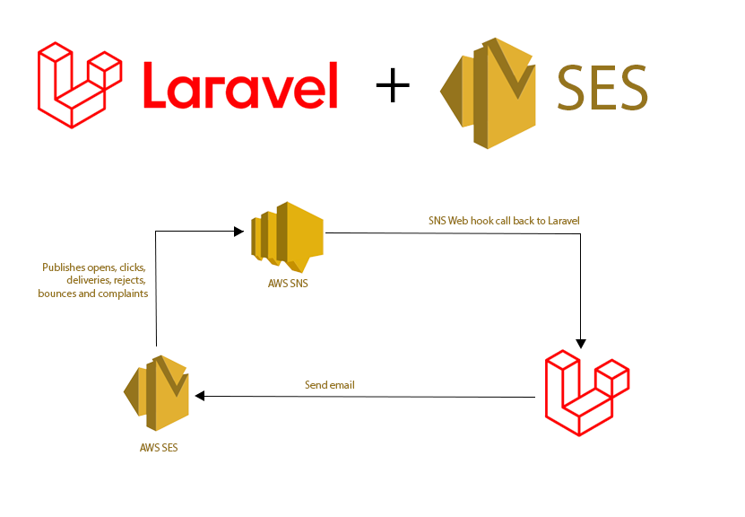

# Laravel AWS Simple Email Service
A Laravel 6+ Package that allows you to get sending statistics for emails you send through AWS SES (Simple Email Service), 
including deliveries, opens, rejects, bounces, complaints and link tracking. This package was originally written by Oliveready7.
Unfortunately the original author had stopped maintaining this package so I decided to create this fork so that this 
package can be used with current versions of Laravel.

All packages have been updated to modern versions. Also added Reject tracking and optimized the original database
storage. Please note that this package is still experimental and currently going thru extensive testing with Laravel 6.x.

## Installation
Install via composer

```
composer require juhasev/laravel-ses
composer require aws/aws-php-sns-message-validator (optional)
```

In config/app.php make sure you load up the service provider. This should happen automatically.
```php
Juhasev\LaravelSes\LaravelSesServiceProvider::class
```

## Laravel configuration
Make sure your app/config/services.php has SES values set

```
'ses' => [
    'key' => your_ses_key,
    'secret' => your_ses_secret,
    'domain' => your_ses_domain,
    'region' => your_ses_region
],
```

Next verify config/mail.php is using SES or add MAIL_MAILER to your .env
```
    'default' => env('MAIL_MAILER', 'ses')
```

Important to note that if you're using an IAM, it needs access to
SNS (for deliveries, bounces and complaints) as well as SES

Make sure your mail driver located in app/config/mail.php is set to 'ses'

Publish public assets

```
php artisan vendor:publish --tag=ses-assets --force
```

Publish migrations

```
php artisan vendor:publish --tag=ses-migrations --force
```

Publish the package's config (laravelses.php)

```
php artisan vendor:publish --tag=ses-config
```

Config Options

- aws_sns_validator - whether the package uses AWS's SNS validator for inbound SNS requests. Default = false
- debug - Debug mode that logs all SNS call back requests

https://github.com/aws/aws-php-sns-message-validator

## AWS Configuration
If you are new to using SES Notification this article is a good starting point

https://docs.aws.amazon.com/sns/latest/dg/sns-http-https-endpoint-as-subscriber.html

At minimum you need to setup assign the IAM user you have selected access rights to send email via SES and to received
SNS notifications.

AWS CloudFormation policy example:
```
  ApplicationSNSPolicy:
    Type: "AWS::IAM::ManagedPolicy"
    Properties:
      Description: "Policy for sending subscribing to SNS bounce notifications"
      Path: "/"
      PolicyDocument:
        Version: "2012-10-17"
        Statement:
          - Effect: Allow
            Action:
              - sns:CreateTopic
              - sns:DeleteTopic
              - sns:Subscribe
              - sns:Unsubscribe
            Resource:
              - 'arn:aws:sns:*'

  ApplicationSESPolicy:
    Type: "AWS::IAM::ManagedPolicy"
    Properties:
      Description: "Policy for creating SES bounce notification"
      Path: "/"
      PolicyDocument:
        Version: "2012-10-17"
        Statement:
          - Effect: Allow
            Action:
              - ses:*
            Resource:
              - '*'

```

Once policies are defined they need to added to the configured IAM user. 

```
  # AWS PHP API User
  APIUser:
    Type: "AWS::IAM::User"
    Properties:
      ManagedPolicyArns:
        - !Ref ApplicationSNSPolicy
        - !Ref ApplicationSESPolicy
      UserName: staging-user
```

Run command in **production** to setup Amazon email notifications to track opens, bounces, rejects, complaints and deliveries. 
Make sure in your configuration your app URL is set correctly and routes setup by this package are working. Next figure
out what is the name of the domain your emails come out from. If it is same as primary app domain no worries just enter
that address. If you do send email for multiple domains (i.e. multi tenant application) you can set multiple domain 
using this command.

```
php artisan sns:setup mydomain.com
```

This commands automatically configures SES domain to send SNS notifications that
trigger call backs to your Laravel application.

## Usage

To send an email with all tracking enabled

```
SesMail::enableAllTracking()
    ->to('hello@example.com')
    ->send(new Mailable);
```

Calling enableAllTracking() enables open, reject, bounce, delivery, complaint and link tracking.

You can, of course, disable and enable all the tracking options

```
SesMail::disableAllTracking();
SesMail::disableOpenTracking();
SesMail::disableLinkTracking();
SesMail::disableBounceTracking();
SesMail::disableComplaintTracking();
SesMail::disableDeliveryTracking();
SesMail::disableRejectTracking();


SesMail::enableAllTracking();
SesMail::enableOpenTracking();
SesMail::enableLinkTracking();
SesMail::enableBounceTracking();
SesMail::enableComplaintTracking();
SesMail::enableDeliveryTracking();
SesMail::enableRejectTracking();
```

The batching option gives you the chance to group emails, so you can get the results for a specific group

```
SesMail::enableAllTracking()
    ->setBatch('welcome_emails')
    ->to('hello@example.com')
    ->send(new Mailable);
```

You can manipulate the results manually by querying the database. Or you can use functions that come with the package.

```

SesMail::statsForEmail($email);

SesMail::statsForBatch('welcome_emails');

// Example result
[
    "send_count" => 8,
    "deliveries" => 7,
    "opens" => 4,
    "bounces" => 1,
    "complaints" => 2,
    "rejects" => 1,
    "click_throughs" => 3,
    "link_popularity" => [
        "https://welcome.page" => [
            "clicks" => 3
        ],
        "https://facebook.com/brand" => [
            "clicks" => 1
        ]
    ]
]
```
You can also use the models directly as you would any other Eloquent model:

```
$sentEmails = SentEmail::whereEmail($email)->get();

$emailBounces = EmailBounce::whereEmail($email)->get();
$emailComplaints = EmailComplaint::whereEmail($email)->get();
$emailLink = EmailLink::whereEmail($email)->get();
$emailOpen = EmailOpen::whereEmail($email)->get();
$emailReject = EmailReject::whereEmail($email)->get();

```
If you are using custom models then you can use ModelResolver() helper like so
```
$sentEmail = ModelResolver::get('SentEmail')::take(100)->get();
```

### Terminology
Send count = number of emails that were attempted

Deliveries = number of emails that were delivered

Opens = number of emails that were opened

Complaints = number of people that put email into spam

Rejects = number of emails AWS rejected to deliver i.e. attached virus

Click throughs = number of people that clicked at least one link in your email

Link Popularity = number of unique clicks on each link in the email, ordered by the most clicked.

## Development

Clone repo to your project under /packages

Setup Composer.json to resolve classes from your dev folder:

```json
 "autoload": {
    "psr-4": {
      "App\\": "app/",
      "Juhasev\\LaravelSes\\": "packages/juhasev/laravel-ses/src"
    }
  },
```

Require

```bash
composer require juhasev/laravel-ses:dev-master
```

To run unit tests execute
```bash
phpunit
```

